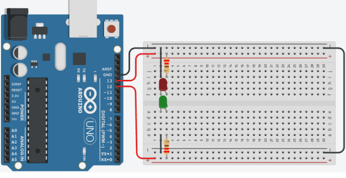

# Arduino_Led_v4
##Contextualizando
Neste projeto faz com que o LED incorporado e dois LEDs pisquem alternadamente
utilizando o pino digital 13 (LED_BUILTIN) e o pino digital 12.
## Esquema do projeto 

